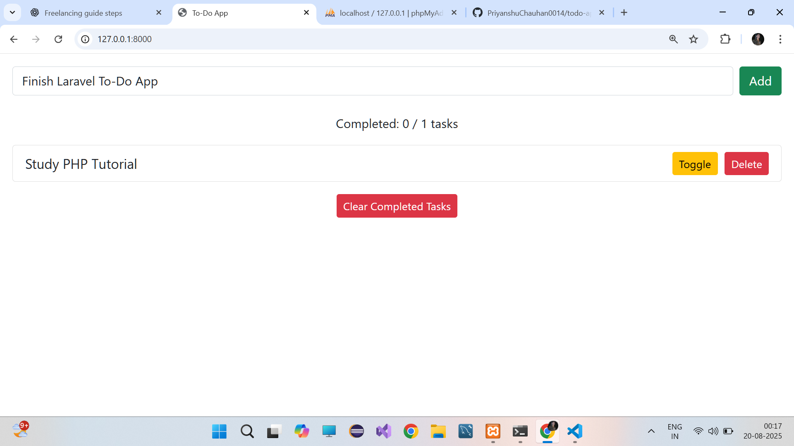
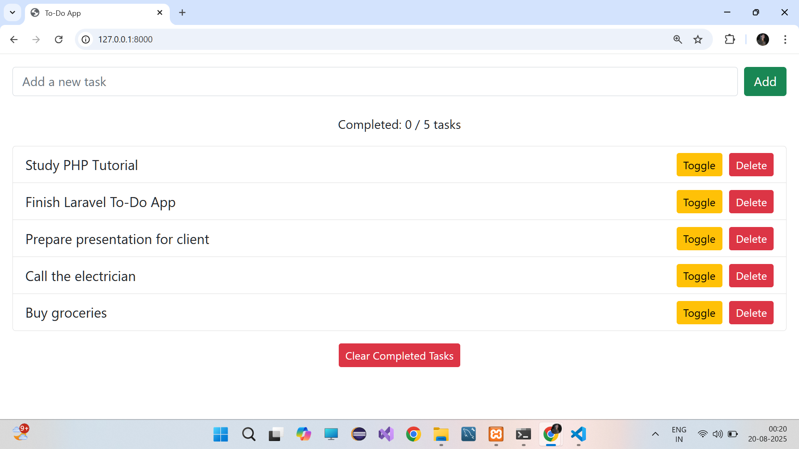
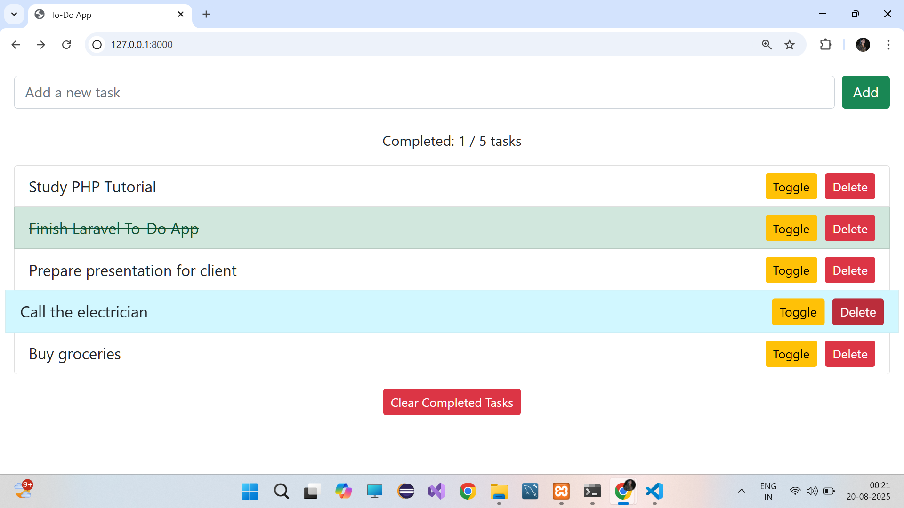
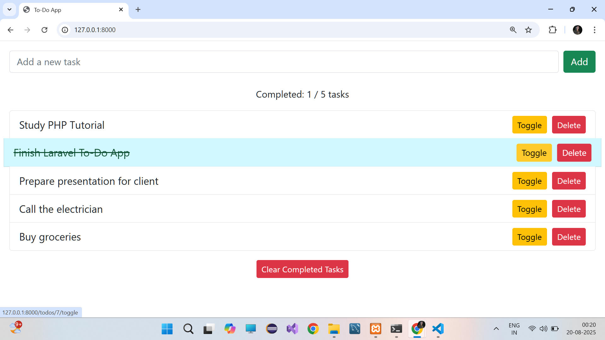

# To-Do App (Laravel)

A modern and responsive To-Do App built with **Laravel** and **SQLite**, featuring a clean **Bootstrap** UI. Users can **add, complete, and delete tasks** easily.

## Tech Stack

- **Backend:** Laravel 10
- **Database:** SQLite
- **Frontend:** Bootstrap 5, HTML, CSS
- **Version Control:** Git & GitHub

## Key Features

- Add new tasks with validation
- Toggle task completion (strike-through for completed tasks)
- Delete tasks individually
- Responsive and attractive UI with hover effects
- Lightweight and portable (uses SQLite)

## Installation

1. Clone the repository:
```bash
git clone https://github.com/PriyanshuChauhan0014/todo-app-php-laravel

## Screenshots






